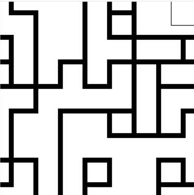

# Wave Function Collapse

## Introduction

> Model synthesis a.k.a. wave function collapse or 'wfc' are names for a family of constraint-solving algorithms commonly used in procedural generation, especially in the video game industry.
> -- [Wikipedia](#resources-and-inspirations)

This project is a Python implementation of the Wave Function Collapse algorithm for procedural image generation with a base tile image-set.

Chooses a random, not-collapsed, cell from the grid with the least amount of entropy and collapses it to a specific tile. Then updates neighboring cells possibilities, reducing their entropy, and repeats until all cells have been collapsed.

## Functionality

+ Resizable grid to easily change generated image size
+ Automatic mode that fills grid cell based on tile with least entropy(number of tile possibilities for that cell)
+ Manual mode where user can choose the tiles themselves
+ Detection if grid is in a dead-end state (some cell has 0 possibilities left)
+ Add new image-sets in resources easily by providing files(png) and describing their side permissions in a yaml file

## Technologies

+ Python 3.12.7
+ Tkinter 8.6
+ PIL 10.4.0

## Simple class structure

### Base classes:
    
+ Tile - responsible for data storage
    + image: Image - image to be displayed on canvas
    + side_constraints: tuple with 4 int's - indicates constraint for each side ot tile (matching side constrains can connect)

+ TileManager - responsible for loading images and creating tiles
    + tiles: list of Tile's - 
    + tile_path: str - path to image directory
    + tile_descriptions: str - path to a yaml files containing a description of images(image file name, side constraints and rotations a given image can have)

+ Cell - responsible for data storage
    + size: int - indicating 
    + possibilities: list of Tile's - all possible tiles for this cell
    + collapsed: bool, indicating whether this cell has chosen a tile

+ CellManager - responsible for drawing a cells' state on canvas, highlighting cell on mouse hover, 
    + cells: list of Cell's - 
    + dim: int - dimension of cell grid(cells[dim x dim])
    + size: int - image side length in pixels
    + _highlight_data: HighlightData - private name for highlighting cell on mouse hover
    + _moves: list of tuples (i, j, direction) -> when checking adjacent cells for reducing entropy on cell collapse

+ WaveFunctionCollapse - responsible for root Tk() window and binding events and configuration loading
with tile/cell from TileManager/CellManager
    + configs: list of configurations for the program - loaded from ConfigLoader and configs.yaml file
    + tile_manager: TileManager
    + cell_manager: CellManager
    + root: tkinter.Tk() - root window for our GUI 
    + canvas: tkinter.Canvas() - used to draw tiles on
        + implements a wave function collapse algorithm to automatically chose cell with least entropy 

### Helper classes:
    
+ ConfigLoader - loads startup program configurations from a config.yaml file
    + path: path to a config.yaml file with program configurations
    + configs: loaded configurations

+ ImageLoader - loads images from provided path with specified extension
    + path: str - path to directory containing image files
    + extension: str - extension of provided image files
    + loaded: loaded images

+ HighlightData - stores data used to highlight cells on mouse hover more efficiently
    + last_row: int - last row in grid mouse hovered
    + last_column: int - last row in grid mouse hovered
    + last_highlight: tkinter id (int) - id of last drawn highlight rectangle

# Resources and inspirations

+ Javascript implementation in p5.js: [The Coding Train](https://www.youtube.com/watch?v=rI_y2GAlQFM)
+ Blender and Godot implementation: [Martin Donald](https://www.youtube.com/watch?v=2SuvO4Gi7uY&t=429s)
+ Classic mathematic interpretation: [Wave Function Collapse](https://en.wikipedia.org/wiki/Wave_function_collapse)
+ Constraint-solving algorithm interpretation: [Model Synthesis](https://en.wikipedia.org/wiki/Model_synthesis)