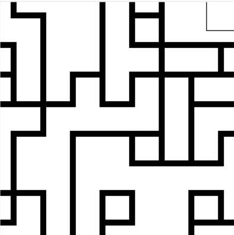
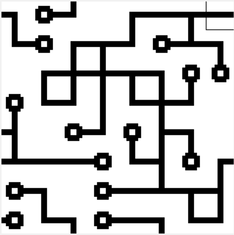
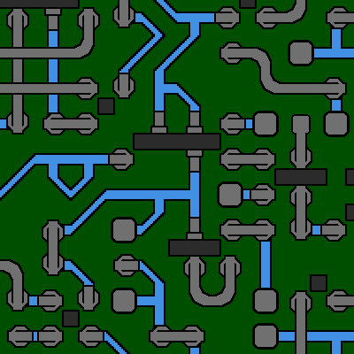
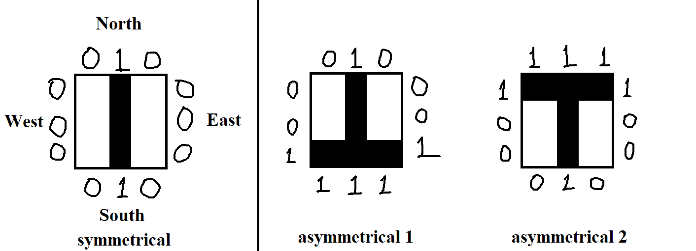

# Wave Function Collapse






## Introduction

> Model synthesis a.k.a. wave function collapse or 'wfc' are names for a family of constraint-solving algorithms (CSP - constrain satisfaction problem) commonly used in procedural generation, especially in the video game industry.
> -- Wikipedia

This project is a Python implementation of the Wave Function Collapse algorithm for procedural image generation with a base tile image-set, written by student Radsolav Botov from Sofia University "St. Kliment Ohridski" Faculty of Mathematics and Informatics for the course 'Programming with Python, 2024/25'.

Chooses a random, not-collapsed, cell from the grid with the least amount of entropy and collapses it to a specific tile. Then updates neighboring cells possibilities, reducing their entropy, and repeats until all cells have been collapsed.

## Functionality

+ Resizable grid to easily change generated image size (only from configs / support different side sizes) ✅
+ Manual mode where user can choose tiles randomly (mouse left click of cell) ✅
+ Add new tilesets 'easily' by providing files(png or jpeg) and describing their side-codes in a yaml file ✅
+ Switch between available tiles sets from GUI (Tile Sets menu > ...) ✅
+ Automatic mode that fills grid cells (Solver menu > solver) ✅
+ Detection if grid is in a dead-end state (some cell has 0 possibilities left) ✅
+ Save current state of canvas as an image (File menu > save as)✅

## Technologies

+ Python 3.12.7
+ pip 24.3.1
+ tkinter 8.6 (built-in)
+ pathlib 1.0.1 (built-in)
+ pillow 11.0.0
+ pyyaml 6.0.2
+ View requirements.txt for other

## Startup
> Activate virtual environment
>
> Install requirements.txt
>
> Run ```python main.py``` with Wave Function Collapse as working directory

## Menus

+ File Menu
    + Save As - save current canvas state as an image
+ Tile Sets - choose from available TileSet's / if you want to clean current canvas, choose a TileSet
    + asymmetrical_tile_set - 18 tile variations / demonstrates asymmetrical images / CAN dead end
    + circuit_tile_set - 88 tile variations / demonstrates more complicated images / CAN dead end
    + default_tile_set - 16 tile variations / demonstrates basic images / CANNOT dead end
+ Cells
    + Show extra information - draw amount of tiles available in each cell to chose from
+ Solver
    + solver - automatically solve and fills current state of canvas / CANNOT be interrupted

## Tile format
A Tile has an image and side_codes.

+ The image is what is show on the canvas upon collapsing the possibilities of a Cell.
+ Side codes describe which tile sides can touch other tiles sides. We represent this with a 12 character string '--- --- --- ---'. (4 substrings of 3 for each side). Each substring of three represents one of four sides: north, east, south, west.
    + We can think of each character in a side, to be describing a pixel on that side of the image(left, middle, right), (top, center, bottom). In this way we can describe how different images are matched. Comparing the side code of one image to the reverse side code of another, tells us whether the sides can touch.
    + In the figure bellow, the WEST side of symmetrical, matches the code of the NORTH side of asymmetrical_1, as such they can touch. 
    + But the EAST side of asymmetrical_1, does not match the code of the WEST side of asymmetrical_2, so they cannot touch.
    + Reading the code of asymmetrical_1 clockwise, starting from NORTH will give us: '010001111100'.



This assignment of codes to a side allows us to support asymmetrical images. If the codes were simple integers, asymmetrical_1 and asymmetrical_2 would have matching side codes , event though visually, they cannot touch.

## How to create a TileSet
A TileSet is made up of two parts: a set of images(png or jpeg, but of same type within same tile set) and a yaml file that describes the tile set.

+ The images should generally be of the same size(the example tile sets use 40px by 40px images). Can be resized through config.file or the GUI.
+ The yaml file should be named the same as the tile set folder name:
    + if tile set folder is named default_tile_set, file must be named default_tile_set.yaml

Format of yaml file. For each image file in folder, there has to be a section describing it as such:
+ <image_file_name>: (without file extension)
    + directions: side_codes of each image side (north, east, south, west)
    + rotations: for each rotation, a copy of original counter-clockwise, will be added to tile set

Directions can be written explicitly as a string of size 12(first 3 characters are NORTH, second set of 3 are EAST and so on) (MUST be written as if reading the codes clockwise starting from NORTH.) or with their cardinal directions as such (cardinal directions, can be written in arbitrary order) (directions is mandatory.):

Example for asymmetrical_1 from previous figure:
+ directions: '010001111100' or '010 001 111 100'
+ directions:
    + east: '001'
    + west: '100' # WEST was READ clockwise (bottom to top)
    + north: '010'
    + south: 1 => equivalent to '111' (an integer is converted to a reputing string of itself 3 times)

Rotations is an integer I, indicating if additional copies of image should be created, each rotated by i * 90 degrees counter-clockwise,
where i in [0:I] (If rotations is missing, it will be tarted as 'rotations: 0'):
+ rotations: 0 => only original image will be created for tile set
+ rotations: 1 => original image + original rotated once 90 degrees left will be created for tile set
+ rotations: 2 => original image + original rotated once 90 degrees left + original rotated twice 90 degrees left will be created for tile set

For practical examples, look at asymmetrical_tile_set(all formats are used there).

# Resources and inspirations

+ Javascript implementation in p5.js: [The Coding Train](https://www.youtube.com/watch?v=rI_y2GAlQFM)
+ Blender and Godot implementation: [Martin Donald](https://www.youtube.com/watch?v=2SuvO4Gi7uY&t=429s)
+ Classic mathematic interpretation: [Wave Function Collapse](https://en.wikipedia.org/wiki/Wave_function_collapse)
+ Constraint-solving algorithm interpretation: [Model Synthesis](https://en.wikipedia.org/wiki/Model_synthesis)

- Wave-Function-Collapse: [GitHub](https://github.com/RadoslavBotov/Wave-Function-Collapse)
