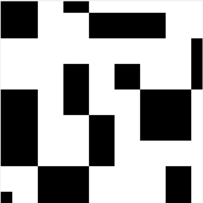

# Wave Function Collapse




## Introduction

> Model synthesis a.k.a. wave function collapse or 'wfc' are names for a family of constraint-solving algorithms commonly used in procedural generation, especially in the video game industry.
> -- Wikipedia

This project is a Python implementation of the Wave Function Collapse algorithm for procedural image generation with a base tile image-set.

Chooses a random, not-collapsed, cell from the grid with the least amount of entropy and collapses it to a specific tile. Then updates neighboring cells possibilities, reducing their entropy, and repeats until all cells have been collapsed.

## Functionality

+ Resizable grid to easily change generated image size ✅❌
+ Manual mode where user can choose tiles randomly ✅
+ Manual mode where user can choose tiles from a list of valid possibilities ❌
+ Add new tilesets easily by providing files(png or jpeg) and describing their side codes in a yaml file ✅
+ Choose from available tiles sets from GUI ✅
+ Automatic mode that fills grid cell based on tile with least entropy(number of tile possibilities for that cell) ❌
+ Detection if grid is in a dead-end state (some cell has 0 possibilities left) ❌
+ Save current state of canvas as an image ❌

## Technologies

+ Python 3.12.7
+ tkinter 8.6 (built-in)
+ pathlib 1.0.1 (built-in)
+ View requirements.txt for other

## Startup
With Wave Function Collapse as working directory start with ```python main.py```.

## Tile format
A Tile has an image and side_codes.

+ The image is what is show on the canvas upon collapsing the possibilities of a Cell.
+ Side codes describe which tile sides can touch other tiles sides. We represent this with a 12 character string '--- --- --- ---'. (4 substrings of 3 for each side). Each substring of three represents one of four sides: north, east, south, west.
    + We can think of each character in a side, to be describing a pixel on that side of the image(left, middle, right), (top, center, bottom). In this way we can describe how different images are matched. Comparing the side code of one image to the reverse side code of another, tells us whether the sides can touch.
    + In the figure bellow, the WEST side of symmetrical, matches the code of the NORTH side of asymmetrical_1, as such they can touch. 
    + But the EAST side of asymmetrical_1, does not match the code of the WEST side of asymmetrical_2, so they cannot touch.
    + Reading the code of asymmetrical_1 clockwise, starting from NORTH will give us: '010001111100'.


This assignment of codes to a side allows us to support asymmetrical images. If the codes were simple integers, asymmetrical_1 and asymmetrical_2 would have matching side codes , event though visually, they cannot touch.

## How to create a TileSet
A TileSet is made up of two parts: a set of images(png or jpeg, but of same type within same tile set) and a yaml file that describes the tile set.

+ The images should generally be of the same size(the example tile sets use 40px by 40px images). Can be resized through config.file or the GUI.
+ The yaml file should be named the same as the tile set folder name:
    + if tile set folder is named default_tile_set, file must be named default_tile_set.yaml

Format of yaml file. For each image file in folder, there has to be a section describing it as such:
+ <image_file_name>: (without file extension)
    + directions: side_codes of each image side (north, east, south, west)
    + rotations: for each rotation, a copy of original counter-clockwise, will be added to tile set

Directions can be written explicitly as a string of size 12(first 3 characters are NORTH, second set of 3 are EAST and so on) (MUST be written as if reading the codes clockwise starting from NORTH.) or with their cardinal directions as such (cardinal directions, can be written in arbitrary order) (directions is mandatory.):

Example for asymmetrical_1 from previous figure:
+ directions: '010001111100' or '010 001 111 100'
+ directions:
    + east: '001'
    + west: '100' # WEST was READ clockwise (bottom to top)
    + north: '010'
    + south: 1 => equivalent to '111' (an integer is converted to a reputing string of itself 3 times)

Rotations is an integer I, indicating if additional copies of image should be created, each rotated by i * 90 degrees counter-clockwise,
where i in [0:I] (If rotations is missing, it will be tarted as 'rotations: 0'):
+ rotations: 0 => only original image will be created for tile set
+ rotations: 1 => original image + original rotated once 90 degrees left will be created for tile set
+ rotations: 2 => original image + original rotated once 90 degrees left + original rotated twice 90 degrees left will be created for tile set

For practical examples, look at asymmetrical_tile_set(all formats are used there).

## Simple class structure

### Base classes:
    
+ Tile - responsible for data storage
    + image: Image - image to be displayed on canvas
    + side_constraints: tuple with 4 int's - indicates constraint for each side ot tile (matching side constrains can connect)

+ TileManager - responsible for loading images and creating tiles
    + tiles: list of Tile's - 
    + tile_path: str - path to image directory
    + tile_descriptions: str - path to a yaml files containing a description of images(image file name, side constraints and rotations a given image can have)

+ Cell - responsible for data storage
    + size: int - indicating 
    + possibilities: list of Tile's - all possible tiles for this cell
    + collapsed: bool, indicating whether this cell has chosen a tile

+ CellManager - responsible for drawing a cells' state on canvas, highlighting cell on mouse hover, 
    + cells: list of Cell's - 
    + dim: int - dimension of cell grid(cells[dim x dim])
    + size: int - image side length in pixels
    + _highlight_data: HighlightData - private name for highlighting cell on mouse hover
    + _moves: list of tuples (i, j, direction) -> when checking adjacent cells for reducing entropy on cell collapse

+ WaveFunctionCollapse - responsible for root Tk() window and binding events and configuration loading
with tile/cell from TileManager/CellManager
    + configs: list of configurations for the program - loaded from ConfigLoader and configs.yaml file
    + tile_manager: TileManager
    + cell_manager: CellManager
    + root: tkinter.Tk() - root window for our GUI 
    + canvas: tkinter.Canvas() - used to draw tiles on
        + implements a wave function collapse algorithm to automatically chose cell with least entropy 

### Helper classes:
    
+ ConfigLoader - loads startup program configurations from a config.yaml file
    + path: path to a config.yaml file with program configurations
    + configs: loaded configurations

+ ImageLoader - loads images from provided path with specified extension
    + path: str - path to directory containing image files
    + extension: str - extension of provided image files
    + loaded: loaded images

+ HighlightData - stores data used to highlight cells on mouse hover more efficiently
    + last_row: int - last row in grid mouse hovered
    + last_column: int - last row in grid mouse hovered
    + last_highlight: tkinter id (int) - id of last drawn highlight rectangle

# Resources and inspirations

+ Javascript implementation in p5.js: [The Coding Train](https://www.youtube.com/watch?v=rI_y2GAlQFM)
+ Blender and Godot implementation: [Martin Donald](https://www.youtube.com/watch?v=2SuvO4Gi7uY&t=429s)
+ Classic mathematic interpretation: [Wave Function Collapse](https://en.wikipedia.org/wiki/Wave_function_collapse)
+ Constraint-solving algorithm interpretation: [Model Synthesis](https://en.wikipedia.org/wiki/Model_synthesis)